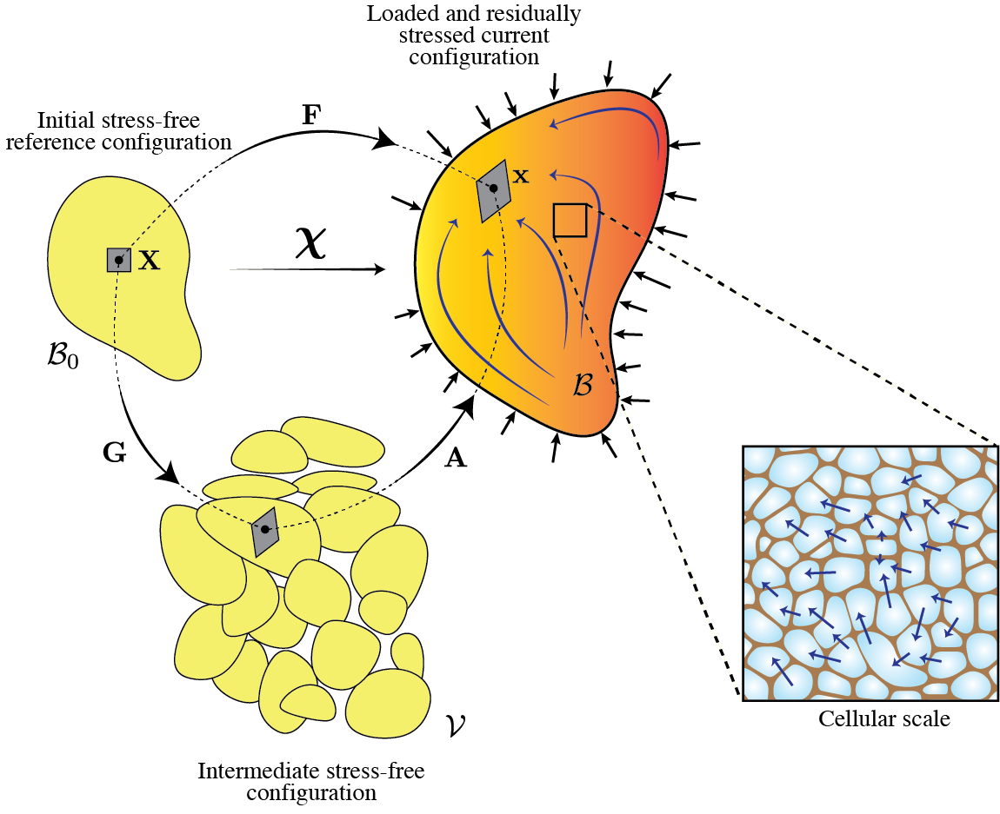
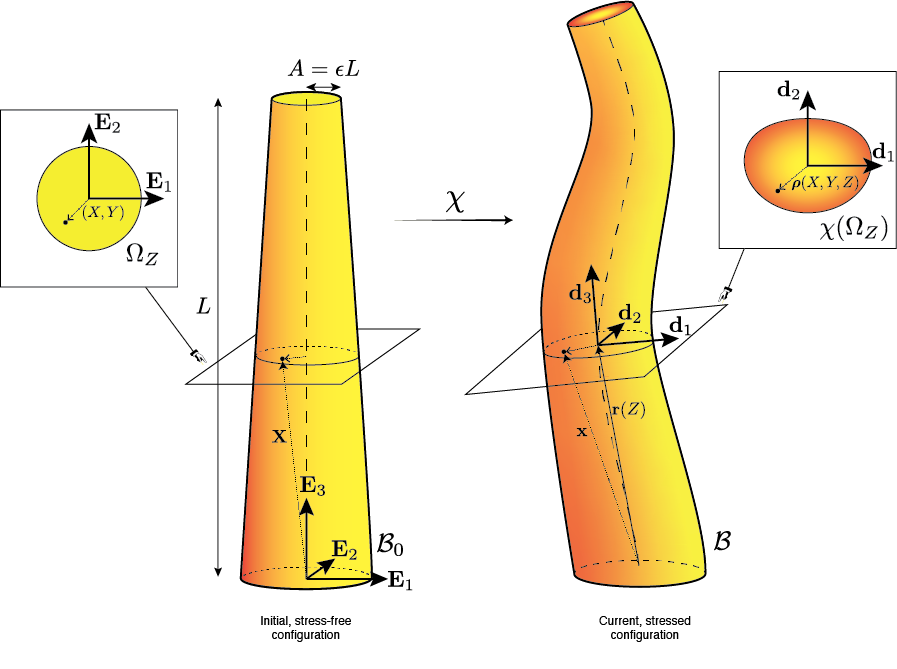
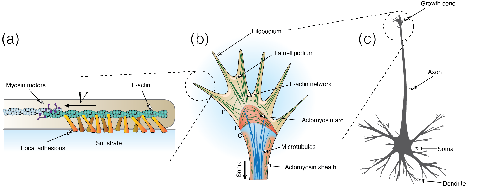

## Research topics

::: {.panel-tabset}

### Plant morphogenesis

I develop theoretical and computational models to understand how plants grow and change shape. The focus is on the physical processes that underlie morphogenesis: water uptake, turgor pressure, cell-wall expansion, tissue mechanics, and growth regulation. Rather than prescribing growth patterns phenomenologically, I aim to derive growth laws from the mechanics of cells and tissues.
A central question is how local cell-scale processes give rise to organ-scale shapes. For example, growing regions can draw water from their surroundings, creating hydraulic competition between neighbouring regions. Mechanical stresses and residual tensions can also influence how tissues expand, bend, or resist deformation. My work combines continuum mechanics, tissue hydraulics, thermodynamics, and numerical simulations to build models that can be compared with experiments on growing plant organs.
The goal is to develop a mechanical theory of plant growth that connects cell-wall behaviour, water transport, and tissue-level form.

::: {.center}
{width=60%}
:::

### Active rods

I develop mathematical models for slender biological structures such as plant shoots, roots, tendrils, flagella, and other filament-like organs. These systems can often be described as rods: one-dimensional curves with mechanical properties, whose length, curvature, and stiffness evolve through growth or internal regulation. Broadly, this project seeks to build a multiscale theory of active rods: slender living structures whose shape is controlled by mechanical, hydraulic, geometric, and biochemical processes acting across scales.

::: {.center}
{width=60%}
:::

A main focus is plant posture control. Shoots and roots bend because growth is not uniform across their cross-section, but this process is usually modelled using prescribed curvature laws or simplified growth profiles. My goal is to derive these rod-level laws from the underlying mechanics of the tissue. In particular, I study how residual stresses arise during growth, how they are distributed between outer and inner tissues, and how their local relaxation or modulation can generate bending.
This work combines continuum mechanics, asymptotic dimensional reduction, and growth laws based on stress, pressure, and cell-wall rheology. Starting from three-dimensional tissue mechanics, the aim is to obtain effective rod models with emergent curvature, stiffness, and internal stress profiles. These models can then be used to study tropisms, proprioception, root navigation in heterogeneous environments, and the mechanics of secondary growth and wood formation.  

### Neuronal growth

I have worked on the mechanics of neuronal axon growth and guidance. Axons are long cellular projections that connect neurons during development, and their growth is influenced not only by chemical cues but also by the mechanical properties of their environment.  

With [Alain Goriely](http://goriely.com) and [Kristian Franze](https://mpzpm.mpg.de/research/kristian-franze), I developed a morphoelastic rod model for nerve guidance by tissue stiffness. In this model, bundles of axons migrate through a mechanically heterogeneous substrate, with their growth direction affected by local stiffness. The theory predicts an analogy between axon guidance and geometrical optics: when axons cross a boundary between regions of different stiffness, their trajectories are deflected according to a law formally equivalent to Snell’s law of refraction. We combined this model with atomic-force-microscopy measurements of the mechanical landscape of the Xenopus brain to test guidance predictions in realistic conditions.  

More recently, with Christoforos Kassianides and Alain Goriely, I extended this approach to a multiscale theory of axonal durotaxis. This model links molecular clutch dynamics in the growth cone, traction forces, and morphoelastic growth of the axon. It predicts that axons can show either positive or negative durotaxis depending on substrate stiffness, and identifies an optimal stiffness controlling axon steering.  

I also studied the rheology of axons with Alain Goriely, [Ellen Kuhl](https://me.stanford.edu/people/ellen-kuhl) and [Rijk de Rooij](https://livingmatter.stanford.edu/people/rijk-de-rooij). In this work, we modelled the axonal cytoskeleton as a network of microtubules connected by tau proteins. The model shows how protein turnover gives rise to an effective viscoelastic response: under slow stretch, axons behave like a Maxwell material, while under fast stretch, cross-link remodelling cannot keep up, leading to mechanical failure and axonal damage.
Together, this work uses mechanics to connect molecular processes, cytoskeletal structure, and whole-axon growth, with applications to neurodevelopment, mechanosensing, and injury.

::: {.center}
{width=90%}
:::

### Biological transport and networks

I study transport, spreading, and clearance processes in biological networks,
with applications to neurodegenerative disease models.

:::

## Selected publications

**[Towards a hydromechanical theory of plant active matter](https://doi.org/10.1017/qpb.2026.10048)**   
H. Oliveri, C. Godin, and I. Cheddadi  
*Quantitative Plant Biology*, accepted, 2026

**[Hydromechanical field theory of plant morphogenesis](https://www.sciencedirect.com/science/article/pii/S0022509625000110)**  
H. Oliveri and I. Cheddadi  
*Journal of the Mechanics and Physics of Solids*, 2025

**[Active shape control by plants in dynamic environments](https://journals.aps.org/pre/abstract/10.1103/PhysRevE.110.014405)**  
H. Oliveri, D. E. Moulton, H. A. Harrington, and A. Goriely  
*Physical Review E*, 2024

**[Theory for durotactic axon guidance](https://journals.aps.org/prl/abstract/10.1103/PhysRevLett.126.118101)**  
H. Oliveri, K. Franze, and A. Goriely  
*Physical Review Letters*, 2021

**[Multiscale integration of environmental stimuli in plant tropism produces complex behaviors](https://www.pnas.org/doi/10.1073/pnas.2016025117)**  
D. E. Moulton, H. Oliveri, and A. Goriely,  
*Proceedings of the National Academy of Sciences*, 2020

[See all publications](publications.html)
